# Morpheus: An Advanced Prediction Market Protocol on the Aptos Blockchain

**Morpheus** is an implementation of Paradigm's groundbreaking Prediction Market Automated Market Maker (PM-AMM), forged on the high-performance Aptos blockchain. Morpheus translates sophisticated financial theory into tested Move smart contracts, harnessing the full power of the Aptos Fungible Asset framework. Our mission is to deliver a capital-efficient, mathematically precise, and fully decentralized platform for the future of prediction markets.

The core of **Morpheus** translates the complex mathematical foundations of the PM-AMM—rooted in Gaussian score dynamics and normal distribution functions—into a secure and modular set of on-chain smart contracts. It provides a superior alternative to traditional AMMs, which are ill-suited for the unique price dynamics of binary outcome tokens.

## Table of Contents
<ol>
    <li><a href="#1-overview">Overview</a>
        <ul>
            <li><a href="#11-introduction">Introduction</a></li>
            <li><a href="#12-foundational-concepts-modeling-and-measuring-lp-risk">Foundational Concepts: Modeling and Measuring LP Risk</a></li>
            <li><a href="#13-the-static-pm-amm">Static pm-AMM</a></li>
            <li><a href="#14-the-dynamic-pm-amm">Dynamic pm-AMM</a></li>
            <li><a href="#15-amm-model-comparison">AMM Model Comparison</a></li>
            <li><a href="#16-conclusion">Conclusion</a></li>
        </ul>
    </li>
    <li><a href="#2-architecture">Architecture</a>
        <ul>
            <li><a href="#21-high-level-workflow">High-Level Workflow</a></li>
            <li><a href="#22-swap-infrastructure">Swap Infrastructure</a></li>
            <li><a href="#23-mint-token-set-infrastructure">Mint Token Set Infrastructure</a></li>
            <li><a href="#24-add-liquidity-infrastructure">Add Liquidity Infrastructure</a></li>
            <li><a href="#25-remove-liquidity-infrastructure">Remove Liquidity Infrastructure</a></li>
            <li><a href="#26-resolving-market-infrastructure">Resolving Market Infrastructure</a></li>
            <li><a href="#27-market-settlement-infrastructure">Market Settlement Infrastructure</a></li>
        </ul>
    </li>
    <li><a href="#3-features">Features</a></li>
    <li><a href="#4-getting-started">Getting Started</a>
        <ul>
            <li><a href="#41-prerequisites">Prerequisites</a></li>
            <li><a href="#42-installation">Installation</a></li>
            <li><a href="#43-configuration">Configuration</a></li>
            <li><a href="#44-running-locally">Running Locally</a></li>
        </ul>
    </li>
    <li><a href="#5-usage">Usage</a></li>
    <li><a href="#6-deployment">Deployment</a></li>
    <li><a href="#7-project-status">Project Status</a></li>
    <li><a href="#8-contributing">Contributing</a></li>
    <li><a href="#9-project-license">Project License</a></li>
    <li><a href="#10-references">References</a></li>
</ol>

## 1. Overview

**Morpheus** is a high-fidelity, open-source implementation of Paradigm's innovative Prediction Market Automated Market Maker (PM-AMM), built on the Aptos blockchain using the Move language. It addresses the shortcomings of traditional AMMs for prediction markets by providing a capital-efficient and mathematically sound framework for trading binary outcome tokens.

The platform offers a seamless user experience, allowing anyone to create new prediction markets, explore existing ones, and engage in a full suite of DeFi activities. The user journey is designed to be simple and powerful:

*   **Discover or Create:** Users can either browse a list of existing markets or create their own from scratch.
*   **Interact on a Dedicated Market Page:** Each market has a dedicated interface that serves as a central hub for all user actions.
*   **Engage with Core Features:** From the market page, users can:
    *    **Swap:** Trade outcome tokens to speculate on the result.
    *    **Mint Pair:** Deposit collateral to receive a full set of outcome tokens.
    *    **Add/Remove Liquidity:** Provide capital to the AMM to earn fees.
    *    **View Analytics:** Access detailed data and performance metrics for the market.

The ultimate goal is to deliver a robust, decentralized, and user-friendly hub for prediction markets on the Aptos network.

### 1.1 Introduction

#### The Challenge of Prediction Market Liquidity

Prediction markets, a compelling application of decentralized finance (DeFi), have been hindered by a fundamental liquidity problem. Standard Automated Market Makers (AMMs) are ill-suited for the unique financial instruments of prediction markets, known as outcome tokens, forcing reliance on less efficient order book models. The Portfolio Management Automated Market Maker (pm-AMM) is a novel mechanism designed specifically to solve this challenge.

#### The Nature of Outcome Tokens

Prediction markets use outcome tokens, which have a binary payoff: they resolve to $1 if a specific event occurs and $0 if it does not. For any event, a "YES" and "NO" token pair is created. The price of a token, bounded between $0 and $1, represents the market's implied probability of that outcome. Unlike standard assets, their value converges to a known state ($0 or $1) at a known future time, a dynamic that conventional AMMs fail to model. 

#### Why Conventional AMMs Fail: A Critique

The Constant Product Market Maker (CPMM), with its $x \cdot y = k$ invariant, is a poor fit for outcome tokens, leading to significant losses for liquidity providers (LPs).

1.  **Guaranteed Loss at Expiration:** At expiration, one token becomes worthless. Arbitrageurs will drain the valuable tokens from the pool, leaving LPs with a portfolio of zero-value assets. This is a permanent, 100% capital loss.
2.  **Inefficient Liquidity Profile:** A CPMM provides liquidity across an infinite price range, which is inefficient for outcome tokens priced between 0 and 1. It fails to account for the changing volatility of outcome tokens as they approach expiration, providing a static and mismatched liquidity profile.

This **asset-model mismatch** highlights the need for specialized financial protocols. The pm-AMM represents a paradigm shift, moving from a generic trading curve to a design based on a rigorous model of the underlying asset.

### 1.2 Foundational Concepts: Modeling and Measuring LP Risk

The pm-AMM is built on a new theoretical toolkit that models outcome token price evolution, quantifies LP risk, and proposes a novel principle to manage that risk.

#### Gaussian Score Dynamics: A Model for Outcome Token Prices

The pm-AMM uses a model called **Gaussian score dynamics**. This model is ideal for markets where the outcome depends on whether an underlying value or "score" (e.g., vote margin, point difference) is above a threshold at a future time. The model assumes this score follows a Brownian motion (a random walk), and the token's price is the probability that the score will end above the threshold. This is analogous to the Black-Scholes model for binary options and allows for a quantitative, model-driven AMM design.

#### Deconstructing Loss-vs-Rebalancing (LVR)

The key risk metric for the pm-AMM is **Loss-vs-Rebalancing (LVR)**, which is the rate of expected losses LPs incur from adverse selection. It quantifies the value extracted by arbitrageurs trading against the AMM's stale prices. Unlike impermanent loss, LVR measures the pure cost of market-making by isolating the loss incurred by a delta-hedged position, representing the unavoidable cost of having passive orders exploited by better-informed traders.

#### The Uniform AMM

The pm-AMM's core design philosophy is the **Uniform AMM**. An AMM is "uniform" if its expected LVR is a constant fraction of the pool's value, regardless of the asset's current price. This makes LP risk stable and predictable, allowing LPs to accurately model their costs (LVR) and determine the trading fees required for profitability. This transforms liquidity provision from a speculative activity into a calculable business.

### 1.3 The Static pm-AMM

The Static pm-AMM is the first implementation of this philosophy, designed to achieve uniform LVR with respect to price at a fixed point in time.

#### The Invariant Formula: A Mathematical Breakdown

The trading curve of the static pm-AMM is defined by the following invariant equation :

$$(y - x) \Phi\left( \frac{y - x}{L} \right) + L \phi\left( \frac{y - x}{L} \right) - y = 0$$

Where:
*   $x$ is the AMM's reserve of one outcome token (e.g., the "NO" token).
*   $y$ is the reserve of the complementary outcome token (e.g., the "YES" token).
*   $L$ is a liquidity parameter that scales the overall size of the pool. A larger $L$ corresponds to a deeper market with lower price impact (slippage) for a given trade size.
*   $\phi(z) = \frac{1}{\sqrt{2\pi}}e^{-z^2/2}$ is the probability density function (PDF) of the standard normal distribution.
*   $\Phi(z) = \int_{-\infty}^{z} \phi(u)du$ is the cumulative distribution function (CDF) of the standard normal distribution.

This formula is a direct mathematical consequence of the Gaussian score dynamics assumption. It is derived by solving a differential equation that sets the rate of change of fractional LVR with respect to price to zero, ensuring the AMM's trading curve meets its risk-management objective.

#### Economic Intuition and Liquidity Concentration

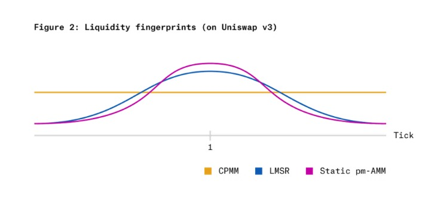

The pm-AMM's invariant concentrates liquidity around a 50% probability and provides less liquidity at extreme probabilities (near 0% or 100%). This is a rational design choice, as legacy models suffer from disproportionately high LVR at these price extremes. The pm-AMM withdraws liquidity from these dangerous zones and deploys it where uncertainty and trading activity are highest, aligning capital efficiency with the market's risk profile.

### 1.4 The Dynamic pm-AMM

The Static pm-AMM successfully normalizes LP risk across price, but it does not account for the dimension of time. The Dynamic pm-AMM extends the model to address the changing risk profile of a prediction market as it approaches its expiration date, aiming to create a constant expected rate of loss over the market's entire lifetime.

#### The Problem of Time Decay and Volatility

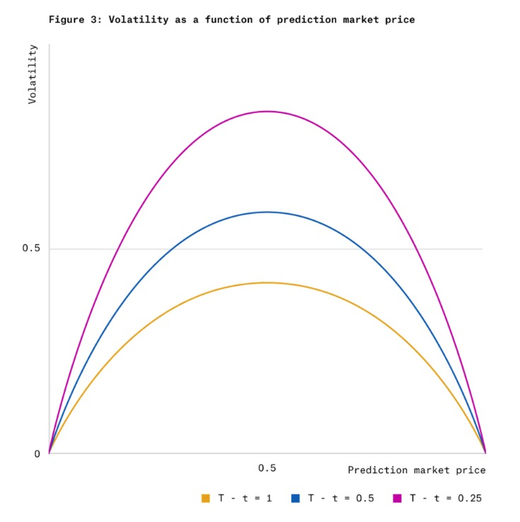

As a prediction market's expiration nears, uncertainty resolves, and prices accelerate towards 0 or 1. This period of heightened volatility magnifies LVR for LPs. A static liquidity profile is ill-equipped to handle this, leading to an escalating rate of loss as time decays.

#### The Time-Dependent Invariant

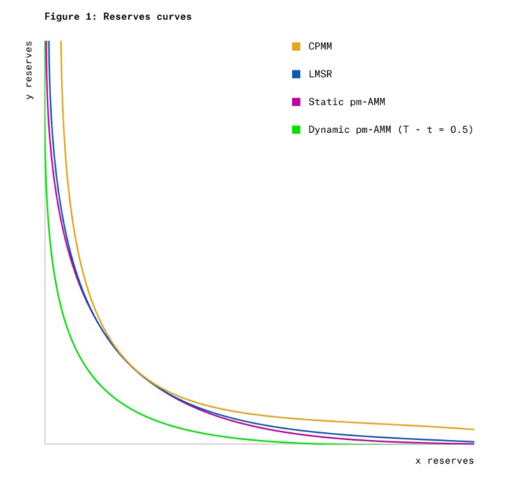

The Dynamic pm-AMM makes the liquidity parameter a function of the time remaining until expiration, $T - t$. The dynamic invariant is :

$$(y - x) \Phi\left( \frac{y - x}{L\sqrt{T - t}} \right) + L\sqrt{T - t} \phi\left( \frac{y - x}{L\sqrt{T-t}} \right) - y = 0$$

The key innovation is replacing the constant liquidity term $L$ with a time-decaying term $L\sqrt{T - t}$. As time $t$ approaches expiration $T$, this term approaches zero, systematically reducing the AMM's liquidity. This acts as a natural defense for LPs, reducing their exposure during the highest-risk phase of the market's lifecycle.

#### Achieving Constant Expected LVR

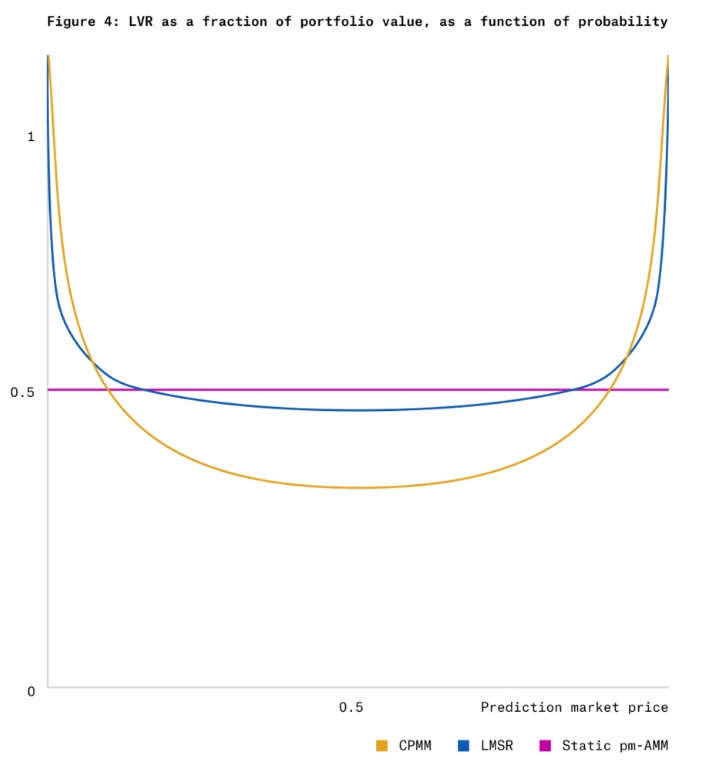

The design of the Dynamic pm-AMM leads to a predictable rate of loss for liquidity providers. This is achieved by ensuring the expected Loss-vs-Rebalancing (LVR) is constant. The derivation begins with the formula for the instantaneous rate of LVR at any time $t$ :

$$\mathsf{LVR}_t = \frac{V_t}{2(T-t)}$$

Here, $V_t$ is the total value of the liquidity pool at time $t$, and $T$ is the market's expiration time. To find the total expected loss, we can derive it step-by-step:

1.  **Find the Expected Instantaneous LVR:** The model is designed so that the expected value of the pool, $\mathbb{E}[V_t]$, decreases in a way that perfectly counteracts the shrinking time to expiration. This results in a constant expected rate of loss :

$$\mathbb{E} = \frac{V_0}{2T}$$

 where $V_0$ is the initial value of the liquidity pool.

2.  **Integrate Over Time:** To find the total expected LVR over the lifetime of the market (from $t=0$ to $t=T$), we integrate this constant expected rate :

$$\text{Total Expected LVR} = \int_0^T \mathbb{E} \,dt = \int_0^T \frac{V_0}{2T} \,dt$$

3.  **Calculate the Final Result:** Solving the integral gives the total expected loss :

$$\text{Total Expected LVR} = \frac{V_0}{2T} [t]_0^T = \frac{V_0}{2T} (T - 0) = \frac{V_0}{2}$$

This powerful result shows that an LP can expect to lose exactly half of their initial capital ($\frac{V_0}{2}$) to arbitrage over the market's lifetime. This transforms LVR from an unpredictable risk into a quantifiable cost, allowing LPs to make more informed decisions about providing liquidity based on expected fee revenue.

### 1.5 AMM Model Comparison

The pm-AMM framework is a significant advancement over existing designs, with implications for both LPs and protocol designers.

The following table provides a comparative analysis of the pm-AMM against the Constant Product Market Maker (CPMM) and the Logarithmic Market Scoring Rule (LMSR), another popular mechanism for prediction markets.

| Feature               | Constant Product (CPMM)                   | Logarithmic (LMSR)                     | **Static pm-AMM**                                         | **Dynamic pm-AMM**                                                                      |
| :-------------------- | :---------------------------------------- | :------------------------------------- | :-------------------------------------------------------- | :-------------------------------------------------------------------------------------- |
| **Invariant**         | $x \cdot y = k$                           | $2^{-x/L} + 2^{-y/L} = 1$              | $(y-x)\Phi(\frac{y-x}{L}) + L\phi(\frac{y-x}{L}) - y = 0$ | $(y-x)\Phi(\frac{y-x}{L\sqrt{T-t}}) + L\sqrt{T-t}\phi(\frac{y-x}{L\sqrt{T-t}}) - y = 0$ |
| **Asset Suitability** | General purpose tokens                    | Prediction Markets (Subsidized)        | Outcome Tokens (Unsubsidized)                             | Outcome Tokens (Unsubsidized)                                                           |
| **Liquidity Profile** | Uniformly distributed                     | Concentrated by subsidy                | Statically concentrated at `p=0.5`                        | Dynamically concentrated, decaying over time                                            |
| **LVR Behavior**      | High at price extremes; unpredictable     | High at price extremes                 | **Uniform across price** (at fixed t)                     | **Uniform across price & time** (in expectation)                                        |
| **LP Loss Profile**   | Guaranteed loss at expiry                 | Potential loss, subsidized by maker    | Predictable loss rate vs. price                           | Predictable total loss over market lifetime                                             |
| **Key Weakness**      | Asset-model mismatch; capital inefficient | Requires external market maker subsidy | LVR increases near expiry                                 | May under-provide liquidity when fees are highest                                       |

### 1.6 Conclusion

The pm-AMM is a landmark in the maturation of DeFi, providing a specialized, theoretically grounded solution for prediction markets. It shifts AMM design from heuristic curve-fitting towards explicit, model-based risk management. This signals a broader evolution away from one-size-fits-all protocols towards a diverse ecosystem of specialized financial machinery, with the pm-AMM's methodology providing a robust foundation for the next generation of AMMs.


## 2. Architecture

The protocol's architecture is designed with a strong emphasis on modularity, security, and clarity. It separates pure mathematical logic from stateful contract management, which significantly enhances auditability, testability, and maintainability. The system is composed of several distinct modules, each with a specific responsibility.

A high-level map of the core smart contract modules within the `pm_amm` package is provided below. This serves as a guide for developers to navigate the codebase and understand the separation of concerns.

| Module                   | Responsibility                                                                                                   | Key Files                               |
| :----------------------- | :--------------------------------------------------------------------------------------------------------------- | :-------------------------------------- |
| `pm_amm.move`            | Main entry point; aggregates user-facing functions and manages global protocol state.                            | `sources/pm_amm.move`                   |
| `prediction_market.move` | Manages the lifecycle of a single market, including Fungible Asset (FA) tokens, collateral, and LP interactions. | `sources/market/prediction_market.move` |
| `pool_state.move`        | Core state management for the AMM pool (reserves, liquidity parameter $L$, fees, dynamic decay).                 | `sources/core/pool_state.move`          |
| `invariant.move`         | Direct implementation of the PM-AMM mathematical invariant and core formulas (pricing, optimal reserves).        | `sources/core/invariant.move`           |
| `liquidity_math.move`    | Pure functions for calculating liquidity addition/removal based on a desired *value* increase.                   | `sources/amm_math/liquidity_math.move`  |
| `swap_math.move`         | Pure functions for calculating swap quotes and outcomes, abstracting the core swap logic.                        | `sources/amm_math/swap_math.move`       |
| `dynamic_tracking.move`  | Manages LP withdrawals and loss tracking for dynamic pools, implementing time-dependent LVR features.            | `sources/core/dynamic_tracking.move`    |
| `fixed_point.move`       | Foundational library for 64.64 fixed-point arithmetic, crucial for all mathematical operations.                  | `sources/math/fixed_point.move`         |
| `normal_dist.move`       | Implements the CDF, PDF, and inverse CDF of the normal distribution, the mathematical bedrock of the PM-AMM.     | `sources/math/normal_dist.move`         |

This layered design is a key architectural strength. By isolating pure, stateless mathematical computations in modules like `invariant.move` and `liquidity_math.move`, the most complex and high-risk components of the AMM can be rigorously tested in isolation. The stateful modules, such as `prediction_market.move`, are then responsible for the simpler logic of asset transfers and state transitions, reducing the surface area for bugs and making the protocol significantly more robust and auditable.

### 2.1 High-Level Workflow

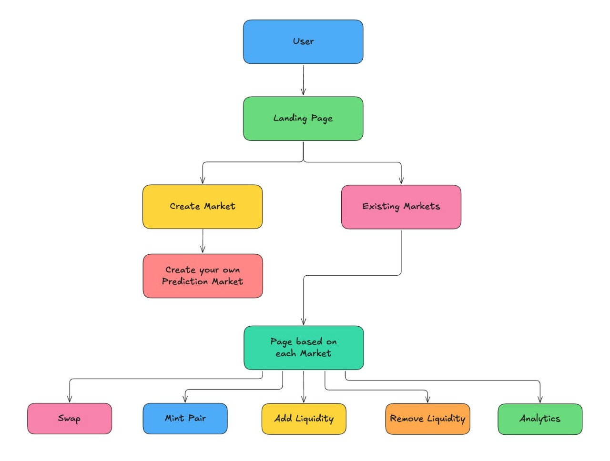

*   **1. Landing Page - The Central Hub:**
    *   All users start on the main **Landing Page**, which acts as the gateway to the entire ecosystem.

*   **2. Market Discovery and Creation:**
    *   From the landing page, users can choose one of two paths:
        *   **Explore Existing Markets:** Browse a curated list of all active and past prediction markets to find opportunities for trading or liquidity provision.
        *   **Create a New Market:** Use the intuitive creation tool to launch a new prediction market with a unique question, outcome, and parameters.

*   **3. The Market Interaction Page:**
    *   Whether creating a new market or selecting an existing one, the user is directed to a dedicated **Market Page**. This page serves as the primary dashboard for all interactions related to that specific market.

*   **4. Core User Actions:**
    *   From the market page, users can seamlessly perform a variety of core DeFi actions:
        *  **Swap:** Trade between the market's outcome tokens (e.g., YES vs. NO) to speculate on the final result.
        *  **Mint Pair:** Deposit collateral to mint a complete set of outcome tokens (one of each possible outcome).
        *  **Add Liquidity:** Become a liquidity provider by depositing assets into the AMM pool to earn trading fees.
        *  **Remove Liquidity:** Withdraw your provided liquidity and any accumulated fees.
        *  **Analytics:** Access a detailed dashboard with key metrics, price history, and performance data for the market.

### 2.2 Swap Infrastructure

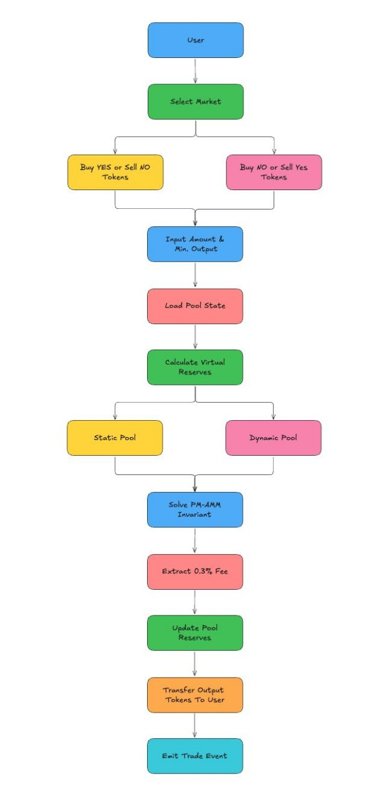

The swapping mechanism allows traders to express their belief in an outcome by trading between a pair of complementary outcome tokens (e.g., "YES" and "NO").

*   **Core Functions:** Swaps are initiated through the `buy_yes_tokens` and `buy_no_tokens` entry functions in the main `pm_amm` module. These functions serve as the public-facing API for traders.

*   **Execution Flow:**
    1.  A trader's call is routed to the corresponding function in `prediction_market.move`, such as `buy_yes`.
    2.  The `prediction_market` module handles all Fungible Asset (FA) operations. It authenticates the user, withdraws the input tokens (e.g., NO tokens) from the user's account, and prepares to transfer the output tokens (e.g., YES tokens).
    3.  The core calculation is delegated to the `pool_state` module, specifically `swap_y_to_x_direct` (for a NO-to-YES swap) or `swap_x_to_y_direct`.
    4.  The `pool_state` module uses the pure, stateless functions in `swap_math.move` to determine the swap's outcome based on the current pool reserves and liquidity.
    5.  `swap_math` ultimately relies on `invariant.move` to solve the PM-AMM invariant equation and find the resulting token amounts.
    6.  After the calculation, `prediction_market` updates its internal FA reserves and transfers the output tokens to the trader.

*   **Mathematical Foundation:** Unlike constant-product AMMs where price is a simple ratio of reserves, the PM-AMM's price is a direct representation of probability, derived from the cumulative distribution function (CDF) of the normal distribution, denoted as $\Phi$. The price $P$ of the YES token (reserve $x$) is given by the marginal price formula :
    $$P = \Phi\left(\frac{y - x}{L}\right)$$

    This formula is implemented in the `invariant_amm::calculate_marginal_price` function. Here, $x$ and $y$ are the reserves of the YES and NO tokens, and $L$ is the pool's liquidity parameter. This ensures that the market price is always a valid probability between 0 and 1 and moves according to the principles of the underlying mathematical model.

### 2.3 Mint Token Set Infrastructure

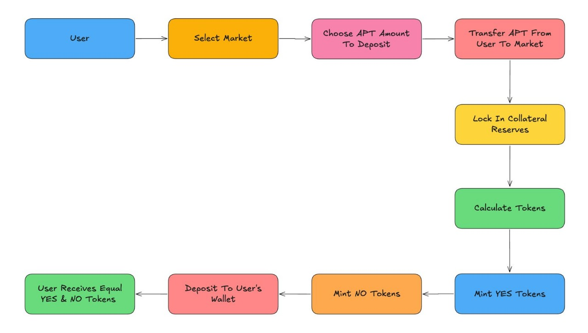

To participate in trading, users first need to acquire the outcome tokens. This is achieved through a collateralization process.

*   **Core Function:** `mint_prediction_tokens`.
*   **Mechanism:** A user deposits a specified amount of a collateral asset (e.g., APT coin) into the market contract. In return, the protocol mints and sends the user a complete set of outcome tokens—an equal amount of YES and NO tokens. For example, depositing 1 APT might yield 1,000,000 YES tokens and 1,000,000 NO tokens.
*   **Economic Principle:** This 1-to-1 collateralization (1 unit of collateral for 1 set of outcome tokens) establishes a crucial economic peg. After the market is resolved, each winning token is redeemable for one unit of the collateral asset (scaled appropriately). This ensures the system is always fully backed and solvent. The `prediction_market::mint_prediction_tokens` function manages the secure transfer of collateral into the market's dedicated resource account and handles the minting of the new FA-based YES and NO tokens.

### 2.4 Add Liquidity Infrastructure

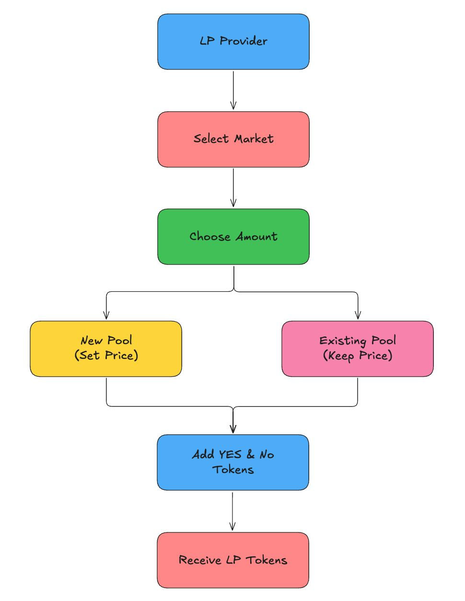

Liquidity provision in the PM-AMM is fundamentally different from traditional AMMs, offering a more intuitive and capital-efficient experience.

*   **Core Function:** `add_market_liquidity`.
*   **Key Innovation:** Instead of requiring Liquidity Providers (LPs) to deposit a specific pair of tokens in a certain ratio, the PM-AMM allows them to add liquidity by specifying a single metric: the `desired_value_increase`. This is a direct and practical implementation of one of the core theoretical concepts from the Paradigm research paper.
*   **Mechanism:**
    1.  An LP calls `add_market_liquidity`, providing a raw `u128` value that represents their desired contribution to the pool's total value, formatted as a fixed-point number.
    2.  The call is handled by `prediction_market::add_pretrade_liquidity`.
    3.  This function fetches the current market price $P$ from the `pool_state`.
    4.  The core logic is executed within `liquidity_math::add_liquidity_pm_amm`. This function takes the `desired_value_increase` and the current price $P$ to calculate the necessary increase in the liquidity parameter, $\Delta L$.
    5.  With $\Delta L$ determined, the protocol then calculates the *exact* amounts of YES and NO tokens the LP must deposit to achieve this liquidity increase without altering the current market price.
    6.  The protocol pulls these precise token amounts from the LP's wallet and mints new LP tokens in return.

*   **Mathematical Foundation:** The relationship between the pool's value V(P), its price $P$, and its liquidity $L$ is defined as $V(P) = L \phi(\Phi^{-1}(P))$, where $\phi$ is the probability density function (PDF) of the normal distribution. To add liquidity at the current price, the protocol computes the required change in liquidity, $\Delta L$, from the user's desired value increase, $\Delta V(P)$, using the inverse relationship :
    $$\Delta L = \frac{\Delta V(P)}{\phi(\Phi^{-1}(P))}$$
    
    This $\Delta L$ is then used with the `invariant_amm::calculate_optimal_reserves` function to determine the precise token deposits required. This elegant mechanism abstracts away the complexity for the LP, who only needs to decide on a single value to contribute.

### 2.5 Remove Liquidity Infrastructure

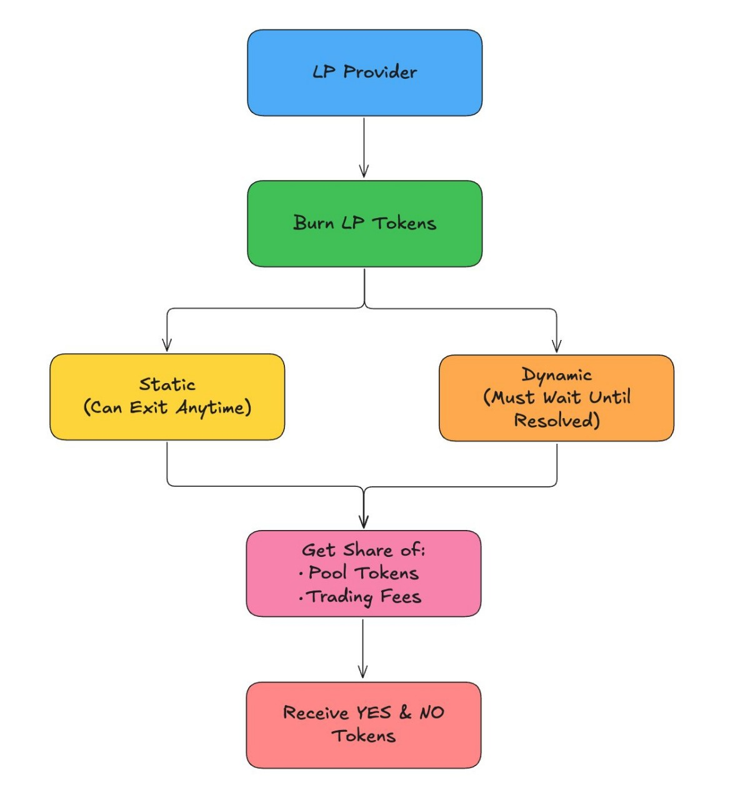

LPs can withdraw their capital and earned fees by redeeming their LP tokens.

*   **Core Function:** `remove_market_liquidity`.
*   **Mechanism:** An LP initiates the process by calling the function with the amount of LP tokens they wish to burn. The `prediction_market::remove_liquidity` function orchestrates the withdrawal.
*   **Proportional Withdrawal:** The protocol calculates the LP's proportional share of the current YES and NO token reserves based on the amount of LP tokens being burned. This is handled by `liquidity_math::remove_liquidity_pm_amm`, which effectively reverses the value-based addition process.
*   **Integrated Fee Distribution:** A key feature of this implementation is the automatic and fair distribution of trading fees. When an LP removes liquidity, the `remove_liquidity` function first calculates their proportional share of all fees that have accumulated in the market's fee vaults. These fee earnings are transferred to the LP along with their principal liquidity, ensuring an immediate and fair settlement of their returns.

### 2.6 Resolving Market Infrastructure

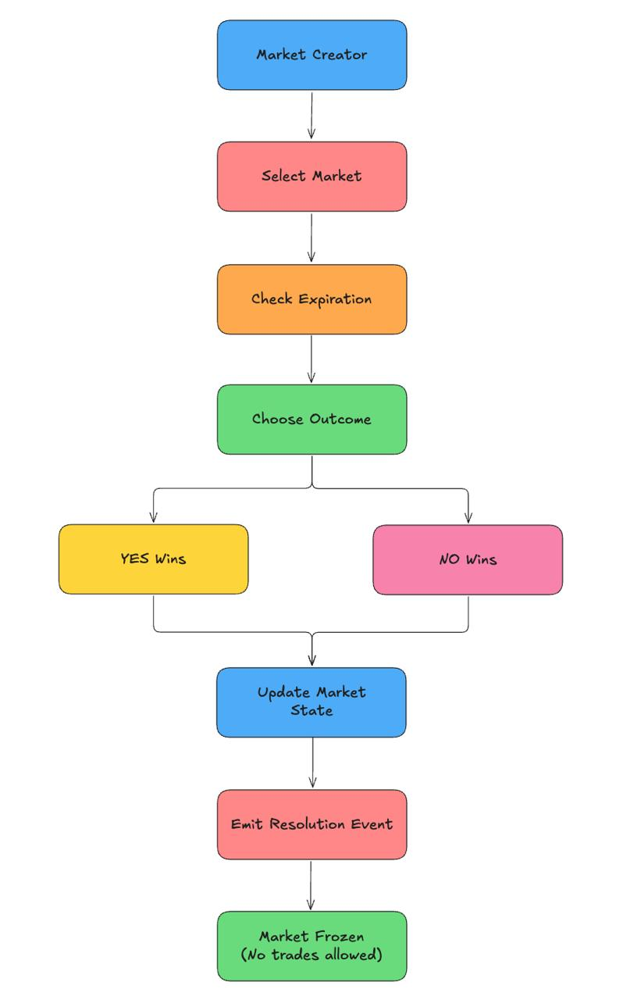

Every prediction market must eventually be resolved to reflect the true outcome of the real-world event.

*   **Core Function:** `resolve_prediction_market`.
*   **Mechanism:** After the event's conclusion and the market's expiration time has passed, the designated market creator calls this function. They provide a single boolean argument, `outcome_yes`, which declares whether the "YES" or "NO" outcome was the correct one.
*   **Security and Trust:** The `prediction_market::resolve_market` function includes a critical access control check: `assert!(raddr == m.creator, E_NOT_AUTHORIZED)`. This ensures that only the original creator of the market can act as the oracle and report the final outcome. This represents a centralized trust assumption in the protocol's design.
*   **State Transition:** A successful resolution sets the market's `resolved` flag to `true` and permanently records the outcome. This action disables all further trading and liquidity operations, transitioning the market into a settlement-only state.

### 2.7 Market Settlement Infrastructure

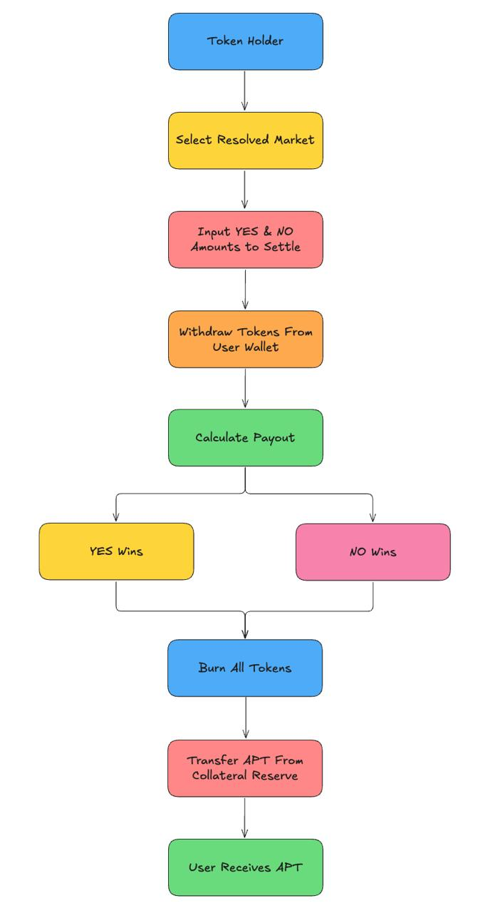

Once a market is resolved, participants can redeem their tokens for the underlying collateral.

*   **Core Function:** `settle_tokens_with_collateral`.
*   **Mechanism:** Token holders call this function to settle their positions. They specify the amount of YES and NO tokens they wish to redeem. The `prediction_market::settle_tokens_with_collateral` function verifies the market's resolved outcome. It proceeds to burn *all* tokens submitted by the user (both winning and losing) but only pays out collateral for the winning tokens.
*   **Example:** If a market resolves to "YES", and a user holds 100 YES tokens and 50 NO tokens, settling this entire position will burn all 150 tokens and return 100 units of collateral to the user. This design encourages users to settle their full position, cleaning up token balances and ensuring a complete redemption cycle.

## 3. Features

This implementation brings the theoretical advantages of the PM-AMM to life with a suite of powerful features designed for prediction markets.

*   **Mathematically Rigorous Pricing:** The protocol avoids simplistic pricing models. Instead, it is founded on Gaussian score dynamics, providing a principled and robust framework for modeling the price evolution of outcome tokens. This is implemented through the `normal_dist.move` and `invariant.move` modules.
*   **Concentrated & Capital-Efficient Liquidity:** The PM-AMM's unique invariant curve naturally concentrates liquidity around a 50% probability, where market uncertainty and trading activity are typically highest. This makes it significantly more capital-efficient for prediction markets compared to general-purpose AMMs like Uniswap V2.
*   **Dynamic, Time-Decaying Liquidity:** The protocol supports **dynamic pools** for markets with a known expiration date. In these pools, the effective liquidity $L$ automatically and predictably decreases as the expiration time approaches, following the formula $L_t = L_0\sqrt{T-t}$. This feature, implemented in `pool_state::get_effective_liquidity`, helps LPs manage the heightened risk and volatility near a market's resolution.
*   **Uniform LVR (Loss-vs-Rebalancing):** The dynamic pool model is designed to offer a more predictable return profile for LPs by targeting a uniform Loss-vs-Rebalancing (LVR). This is achieved through the combination of time-decaying liquidity and a systematic LP withdrawal mechanism managed by the `dynamic_tracking.move` module, which allows LPs to de-risk their positions over the market's lifetime.
*   **Value-Based Liquidity Provision:** Simplifying the LP experience, the protocol allows providers to contribute capital by specifying a single *value* they wish to add to the pool. The smart contracts then automatically calculate the optimal amounts of YES and NO tokens required, maximizing efficiency and removing guesswork.
*   **Built on Aptos with Fungible Assets:** The entire system is built using the modern Aptos Fungible Asset (FA) standard for all its tokens (YES, NO, and LP). This ensures full composability and compatibility with the broader Aptos DeFi ecosystem, allowing tokens to be used in other protocols, wallets, and explorers.

## 4. Getting Started

Follow these instructions to set up the project locally for development and testing.

### 4.1 Prerequisites

*   **Aptos CLI:** You must have the Aptos CLI installed. Follow the official instructions at [aptos.dev](https://aptos.dev/cli-tools/aptos-cli/install-aptos-cli).
*   **Move Language:** A basic understanding of the Move programming language is recommended.
*   **Node.js:** Required for running client-side scripts or a potential frontend application.

### 4.2 Installation

Clone the repository to your local machine:
```bash
git clone <repository_url>
cd <repository_name>
```


### 4.3 Configuration

Ensure your Aptos CLI is configured to a local network, devnet, or testnet. You can create a new profile or use an existing one. The project's dependencies, primarily the `AptosFramework`, are managed in the `Move.toml` file.

### 4.4 Running Locally

1.  **Start a local network (optional):**

    ```bash
    aptos node run-local-testnet --with-faucet
    ```

2.  **Compile the project:**
    Before compiling, you may need to fetch the dependencies defined in `Move.toml`.

    ```bash
    # Set up a profile if you haven't already
    aptos init --profile local

    # Compile the Move package
    aptos move compile --named-addresses pm_amm=<YOUR_ACCOUNT_ADDRESS>
    ```

3.  **Run the test suite:**
    The project includes a comprehensive test suite. To run all tests, execute:

    ```bash
    aptos move test
    ```

    For more detailed testing instructions, including how to run specific test modules, refer to the `tests/README.md` file.

## 5. Usage

You can interact with the deployed smart contracts using the Aptos CLI. The JSON files in the repository root and `/json_files` directory provide examples of the required arguments for each function.

**Note:** Replace `0x...` with the actual address where the `pm_amm` module is deployed.

  * **Create a Prediction Market:**

    ```bash
    # See create_market_args.json for the argument structure and types
    aptos move run \
      --function-id '0x...::pm_amm::create_prediction_market' \
      --json-file create_market_args.json
    ```

  * **Add Liquidity to a Market:**

    ```bash
    # See add_liquidity_args.json for the argument structure 
    aptos move run \
      --function-id '0x...::pm_amm::add_market_liquidity' \
      --json-file add_liquidity_args.json
    ```

  * **Execute a Swap (Buy YES Tokens):**

    ```bash
    # See buy_yes_args.json for the argument structure
    aptos move run \
      --function-id '0x...::pm_amm::buy_yes_tokens' \
      --json-file buy_yes_args.json
    ```

  * **View Market Information:**

    ```bash
    # See get_market_info.json for the argument structure
    aptos move view \
      --function-id '0x...::pm_amm::get_market_info' \
      --json-file json_files/get_market_info.json
    ```

## 6. Deployment

Follow these steps to deploy the PM-AMM protocol to an Aptos network (devnet, testnet, or mainnet).

1.  **Compile the Package with Metadata:**
    Compile the contracts and save the build metadata. This is required for deployment. Replace `<DEPLOYER_ADDRESS>` with the address of the account you are deploying from.

    ```bash
    aptos move compile --save-metadata --named-addresses pm_amm=<DEPLOYER_ADDRESS>
    ```

2.  **Publish to the Network:**
    Use the `publish` command with the appropriate profile for your target network.

    ```bash
    # Ensure your CLI is configured for the target network
    aptos move publish --profile <PROFILE_NAME>
    ```

3.  **Initialize the Protocol:**
    After the module is published, the designated admin account must call the `initialize` function one time to set up the global protocol configuration, such as the fee recipient address.

    ```bash
    aptos move run \
      --function-id '<DEPLOYER_ADDRESS>::pm_amm::initialize' \
      --args 'address:<FEE_RECIPIENT_ADDRESS>' 'u16:<PROTOCOL_FEE_RATE>'
    ```

    This function can only be called once and is protected to ensure it's called by the account that deployed the contract.

## 7. Project Status

  * **Current Stage:** The protocol is considered **Beta** and is feature-complete according to the core design of the PM-AMM.
  * **Audits:** The smart contracts have **not yet undergone a formal third-party security audit**. Use in a production environment is at your own risk.
  * **Testing:** The project is supported by a comprehensive test suite that covers mathematical correctness, contract integration, and various edge cases. The testing philosophy and coverage details can be found in `tests/README.md`. The codebase demonstrates a strong commitment to quality and correctness through its extensive testing.

## 8. Contributing

Contributions are welcome\! If you'd like to contribute to the project, please follow these steps:

1.  Fork the repository.
2.  Create a new feature branch (`git checkout -b feature/NewFeature`).
3.  Make your changes and commit them (`git commit -m 'Add some NewFeature'`).
4.  Ensure your changes are accompanied by corresponding tests.
5.  Push your changes to your branch (`git push origin feature/NewFeature`).
6.  Open a Pull Request for review.

## 9. Project License

This project is licensed under the **Apache 2.0 License**.

## 10. References

  * **Primary Research Paper:** [pm-amm by Paradigm](https://www.paradigm.xyz/2024/11/pm-amm) 
  * **Aptos Move Language Documentation:**([https://aptos.dev/move/book/introduction](https://www.google.com/search?q=https://aptos.dev/move/book/introduction))
  * **Aptos Fungible Asset Standard:**([https://aptos.dev/standards/fungible-asset](https://www.google.com/search?q=https://aptos.dev/standards/fungible-asset))